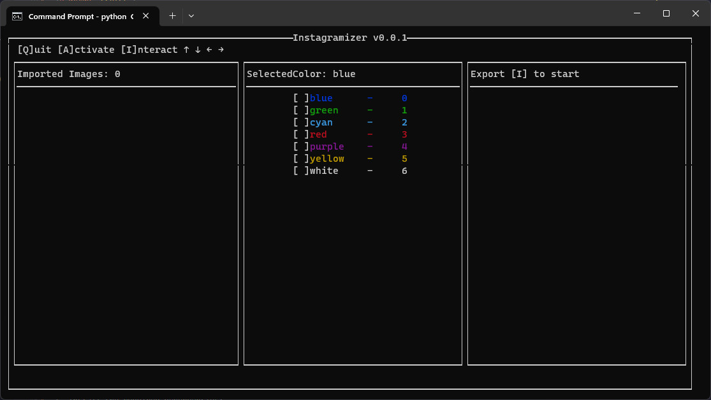
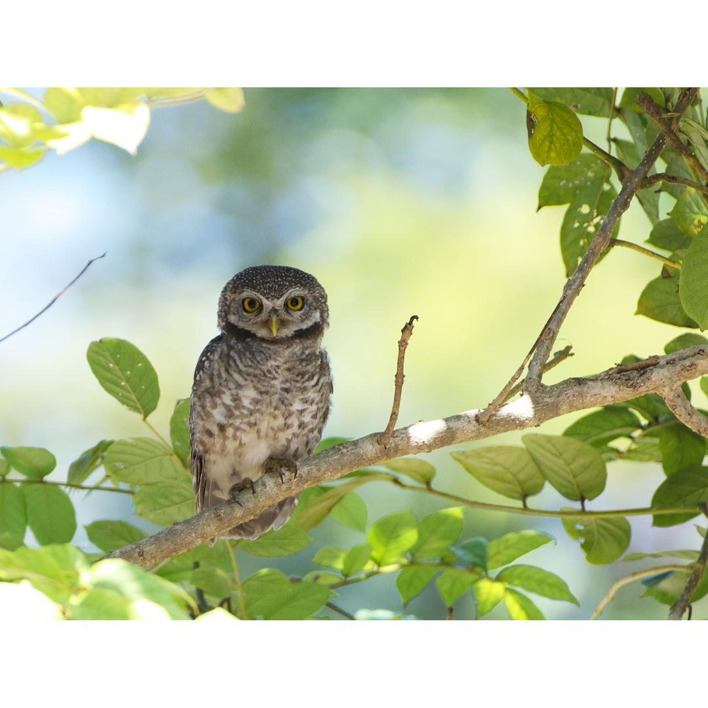

<h1 align="center">
  Instagramizer
</h1>

<p align="center">
  <strong>A command-line tool to easily process images for Instagram</strong>
</p>

<p align="center">
  
</p>

<p align="center">
  <a href="#features">Features</a> •
  <a href="#installation">Installation</a> •
  <a href="#usage">Usage</a> •
  <a href="#before-and-after">Before and After</a> •
  <a href="#todo">TODO</a> •
  <a href="#license">License</a>
</p>

---

## Features

- Batch add color frames to images
- Resize images to 1080x1080 pixels
- Simple and easy-to-use command-line interface

---

## Installation

1. Clone the Instagramizer repository:

   ```shell
   git clone https://github.com/your_username/instagramizer.git
   ```

2. Navigate to the project directory:

   ```shell
   cd instagramizer
   ```

3. Install the required dependencies:

   ```shell
   pip install -r requirements.txt
   ```

---

Apologies for the misunderstanding. Here's the corrected usage section:

```
## Usage

1. Navigate to the project directory:

   ```shell
   cd instagramizer
   ```

2. Run the Instagramizer program:

   ```shell
   python CUI.py
   ```

3. Use the following keys to navigate through the modes:

   - `←` and `→` arrow keys: Select different modes.
   - `↑` and `↓` arrow keys: Scroll through image files in the Import mode.
   - `A`: Activate the selected mode as the active mode.
   - `I`: Interact with the current active mode.
   - `Q`: Quit the program.

4. Inside the Import mode:

   - Press `I` to import the selected file.
   - Use the `↑` and `↓` arrow keys to scroll through image files.
   

6. Inside the Color Selection mode:

   - Use the `↑` and `↓` arrow keys to select the background color.

7. Inside the Export mode:

   - Press `I` to start the exporting process and generate the processed images.


```

Please note that I've updated the key instructions based on your requirements.
---

## Before and After

<p align="center">
  <strong>Before</strong>
  <br>
  
</p>

<p align="center">
  <strong>After</strong>
  <br>
  
</p>

---

## TODO

1. Support responsive terminal size
2. Implement threading for faster export
3. Console Based File Browser

Feel free to contribute by submitting a pull request to the project repository.

---

## License

This project is licensed under the MIT License. See the [LICENSE](LICENSE) file for more information.

---

<p align="center">
  Developed with ❤️ by @WasinUddy
</p>
